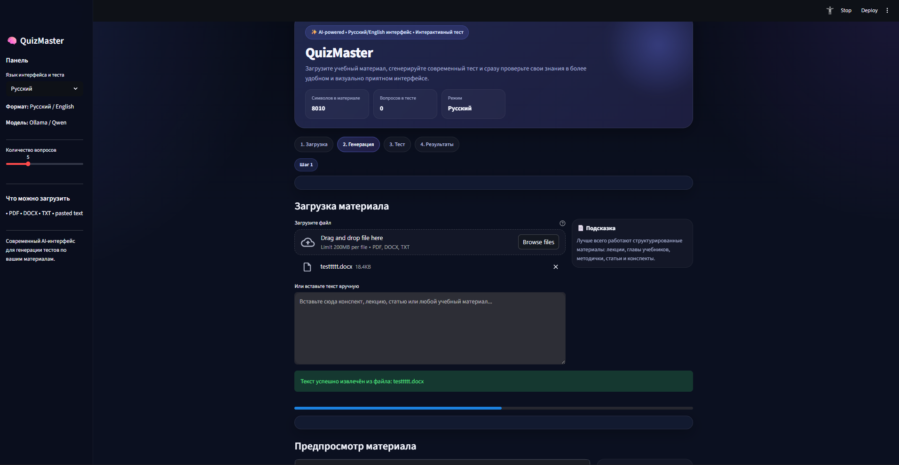
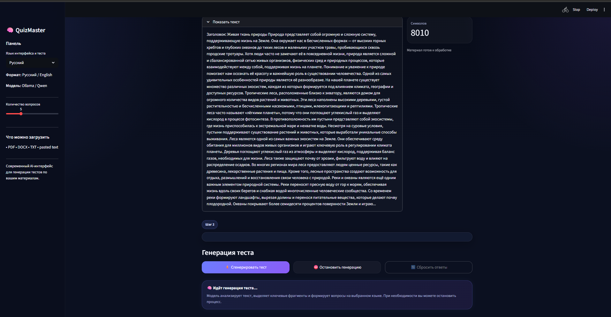
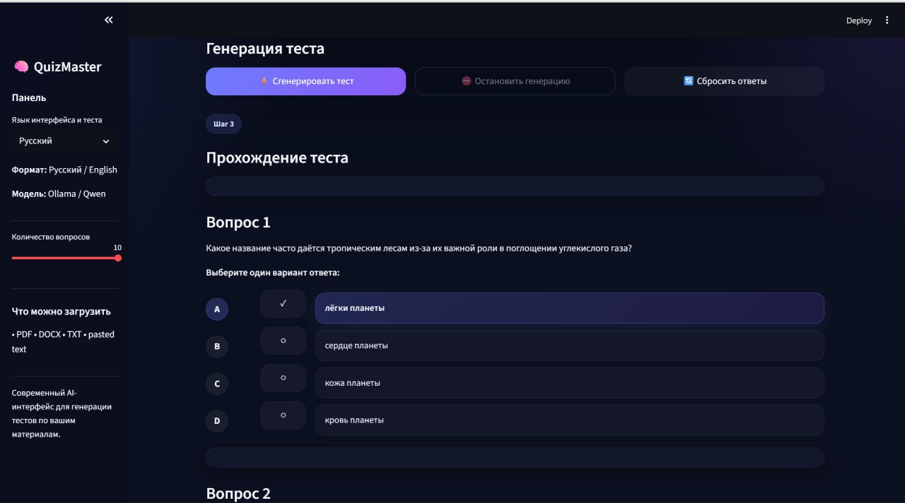
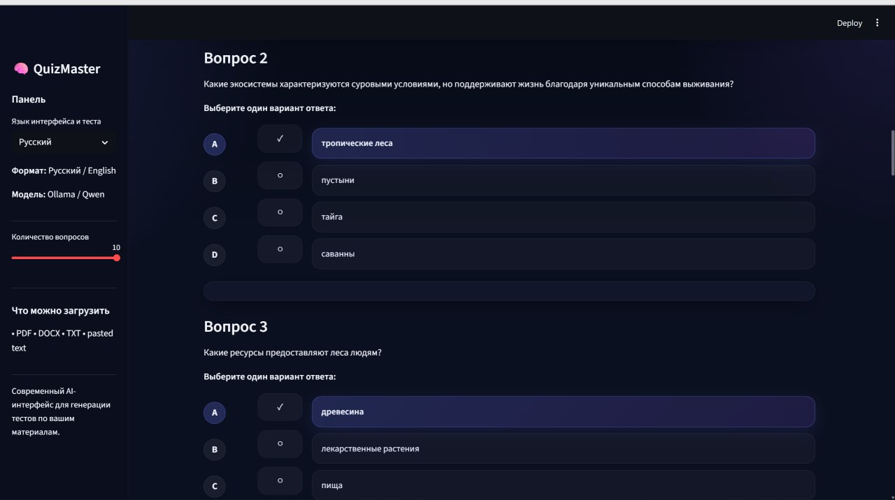
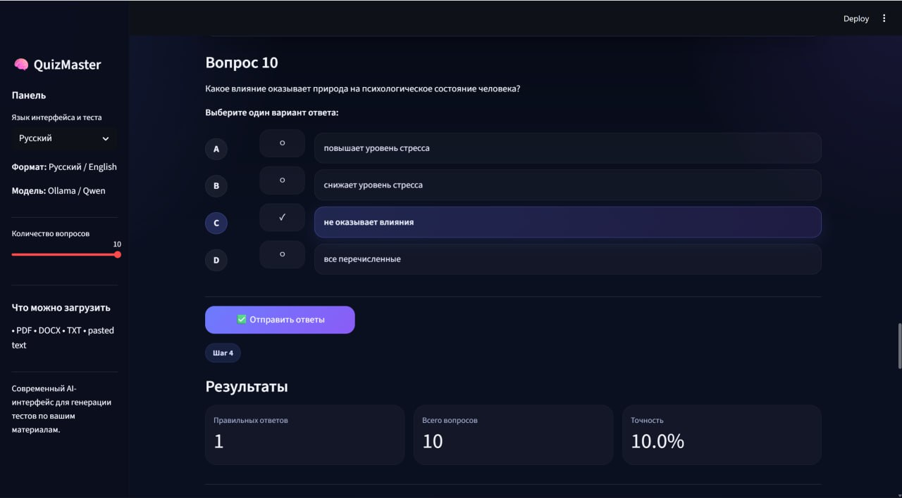
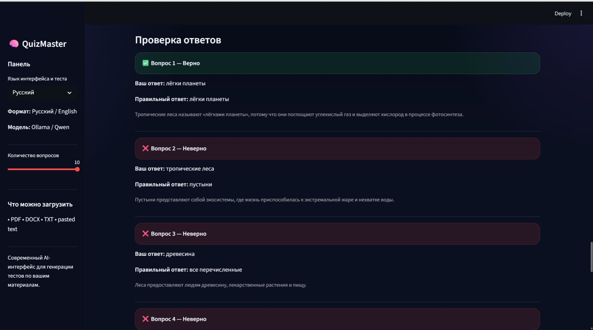
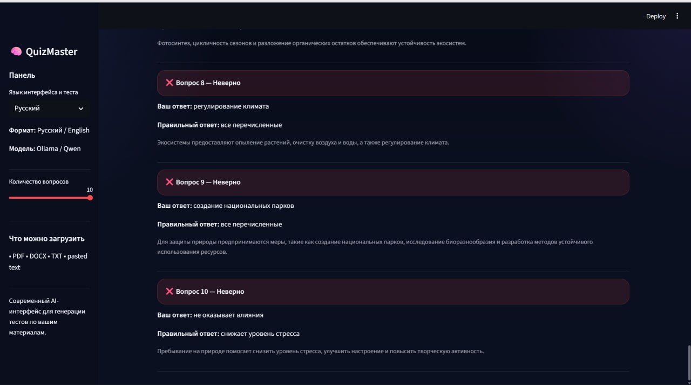

# QuizMaster
QuizMaster — это приложение для автоматической генерации тестов на основе учебных материалов.
Пользователь может загрузить документ или вставить текст, после чего система анализирует содержимое и создаёт тестовые вопросы с использованием локальной языковой модели.

Проект разработан как инструмент для упрощения проверки знаний и подготовки к экзаменам.
## Интерфейс приложения

## Application Screenshots

<p align="center">
  
</p>

<p align="center">
  
</p>

<p align="center">
  
</p>

<p align="center">
  
</p>

<p align="center">
  
</p>

<p align="center">
  
</p>

<p align="center">
  
</p>

## Основные возможности
- Загрузка файлов форматов PDF, DOCX и TXT

- Вставка текста вручную

- Автоматическая генерация вопросов с использованием ИИ

- Поддержка нескольких языков

- Прохождение теста прямо в интерфейсе приложения

- Автоматическая проверка ответов

- Работа с локальной LLM через Ollama (без использования облачных API)
##  Архитектура проекта
Приложение состоит из нескольких основных компонентов:

### 1. Интерфейс пользователя
Реализован с помощью Streamlit. Позволяет загружать файлы, генерировать тесты и отвечать на вопросы.

### 2. Обработка текста
Загруженный текст разбивается на части (chunking), чтобы модель могла эффективнее анализировать информацию.

### 3. Генерация вопросов
Для создания тестовых вопросов используется локальная языковая модель, запущенная через Ollama.

### 4. Оценивание результатов
После прохождения теста система автоматически проверяет ответы и показывает результат.
## Структура проекта 
QuizMaster_HSE-main/

app.py — основной файл приложения
requirements.txt — список зависимостей
utils/ — вспомогательные функции для обработки текста и генерации вопросов
README.md — описание проекта
## Установка
### 1. Клонирование репозитория
```bash
git clone <https://github.com/rk963/QuizMaster_HSE.git>
cd QuizMaster_HSE-main
```
### 2. Установка зависимостей
```bash
pip install -r requirements.txt
```

## 1. Установка Ollama

Скачайте и установите **Ollama** с помощью PowerShell:

``` powershell
irm https://ollama.com/install.ps1 | iex
```

------------------------------------------------------------------------

## 2. Проверка установки

Проверьте, что Ollama установлен корректно:

``` bash
ollama --version
```

Если отображается номер версии, значит установка прошла успешно.

------------------------------------------------------------------------

## 3. Загрузка модели

Загрузите модель **Qwen 2.5 (14B)**:

``` bash
ollama pull qwen2.5:14b
```

------------------------------------------------------------------------

## 4. Установка Python‑зависимости

Установите необходимый пакет:

``` bash
pip install requests
```

------------------------------------------------------------------------

## 5. Переход в папку проекта

Перейдите в директорию вашего проекта:

``` bash
cd path/to/project
```

Замените `path/to/project` на фактический путь к папке проекта.

------------------------------------------------------------------------

## 6. Запуск приложения

Запустите приложение **Streamlit**:

``` bash
streamlit run app.py
```

После этого интерфейс приложения откроется в браузере.

------------------------------------------------------------------------

## Быстрые шаги

1.  Установить Ollama\
2.  Проверить установку\
3.  Скачать модель `qwen2.5:14b`\
4.  Установить `requests`\
5.  Перейти в папку проекта\
6.  Запустить приложение командой `streamlit run app.py`
## Как пользоваться
- Запустите приложение.

- Загрузите документ или вставьте текст.

- Нажмите кнопку генерации теста.

- Ответьте на сгенерированные вопросы.

- Получите результат и оценку.
## Технологии
Проект использует следующие технологии:

- Python

- Streamlit

- Ollama

- Large Language Models (LLM)

- Обработка текстовых данных
